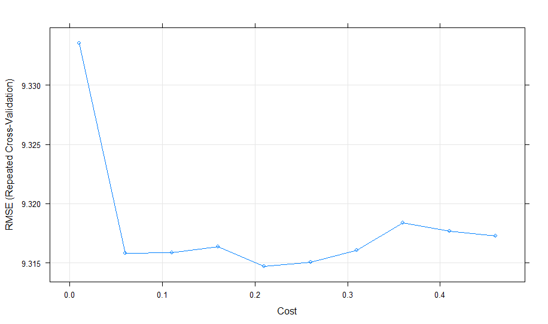

```{r setup, include=FALSE}
knitr::opts_chunk$set(echo = TRUE)
```


# Overview

In the song “You Wanted a Hit” by LCD Soundsystem, the lyrics seem to hint of a list of requirements that the artists received about the songs they were creating.  Obviously, the record-label executives want their artists to produce hit songs so that they can enjoy the successful financial returns that would generate.  For the artist, there is more to the equation than just a profit motive; they likely want an opportunity to perform, to share their story and provide something that the audience enjoys, relates or feels some connection to.  The scope of this project is focused on the former perspective and goal of creating a hit song.  In the aforementioned lyrics, there seem to be some specific things the artist is requested to include:
“You wanted a hit….
…You wanted it tough…
…You wanted it lush…
…You wanted it real…
…You wanted the truth…”
While only a few may know the truth behind the list of requests, and if it is verbatim or more of a metaphor but it does seem to indicate that there are certain things the record label believes will create a hit song.  This notion had made me wonder if there is in fact a way to know if a song will be popular upon release.  While working through the HarvardX Data Science course on EDX, and getting the opportunity to participate in the choose your own data science project, this felt like a great opportunity to find out!

A quick search through some Kaggle (http://www.kaggle.com) content led me to the “Spotify Dataset 1921-2020, 160k+ Tracks” dataset.  This dataset has been graciously compiled and made available by Yamac Eren Ay.  The dataset was developed through the use of Spotify APIs and consists of several datasets, including one which has a list of over 170,000 songs released between 1921 and 2020.  The data includes several attributes which are provided by Spotify and include things like the “acousticness”, the “tempo”, and then “loudness” of a given song.  In addition to other features, each song has a “popularity” score, which is an indicator of the song’s popularity between 0 and 100.  The goal of our data science challenge here is to develop a model to predict the popularity of a song, given the attributes we know (which are provided via Spotify).  

The data provided includes over 170,000 observations, with each observation in the data representing a song, and several features or variables, including:

Column Label | Description
------------- | -------------
Valence | A relative measure of the positiveness of the track.
Year | Release year of the track.
Acousticness | Relative measure of how acoustic the track sounds.
Artists | A list of artists credited with the song.
Danceability | Relative measurement of how danceable the song is (0 – 1).
Duration_ms | Length of the song in milliseconds.
Energy | Relative energy level of the track (0 – 1).
Explicit | Binary indicator of explicit content in the song.
Instrumentalness | Proportion of the track that is instrumental.
Key | The primary key of the track (expressed as an integer equating to a musical key).
Liveness | Proportion of the track that sounds like a live performance.
Loudness | Relative loudness of the track in decibels.
Mode | Indicates if the song starts with a musical progression or not.
Name | Title of the song.
Popularity | Recent popularity of the song in the US (0-100).
Release Date | Date of the song’s release.
Speechiness | The relative proportion of the track with voice.
Tempo | The tempo of the track, expressed in Beats Per Minute (BPM).

Having established a goal and a starting dataset it was time to dive in on some further analysis and discovery of the data.  I did this by running a few summary statistics, visualizing some of the data and the relationships, and cleansing or re-shaping some of the features to enhance the core dataset.  This involved a few iterations of review, thinking/reflecting on some of the observations, followed by additional data cleansing (and repeating the process).  Some of the data cleansing steps included creating and adding an artist genre categorization, adding an overall artist popularity factor normalized for the number of tracks by that artist, converting some of the data to factors, and applying feature scaling.  We will get into more details in the methods/analysis section below, but as I thought about the challenge – trying to identify a hit song, two possible ways to approach this solution stuck with me; We could attempt to predict the “popularity” of a song (between 0-100) or we could define classifications for the popularity and try to determine if a song would fall into the “hit” class.  In essence, I wanted to consider this as either a regression or a classification challenge to see which approach would perform better across multiple models.  Having prepared the data for modeling, it was randomly split into test and training datasets.  The training datasets were used for model training and tuning, while the test dataset was used at the end to validate and test model performance.  The details of the tuning, training, and testing process are provided below in the methods/analysis section.  Ultimately, the final algorithms were run against the test data, and the performance was reviewed.  The regression models used the RMSE, some testing of specific examples, and a review of the model performance on the test data to get a sense of the performance.  The classification models were reviewed by examining the accuracy, the confusion matrix results, and a check of some examples within the predicted data – specifically comparing the actual vs predicted “hits”.

# Methods/Analysis
As described above, the dataset obtained from Kaggle was loaded to r studio, and then analysis, cleansing and enhancing steps were taken to further enrich and optimize this data for the predictive modeling challenge.  In the following section we will discuss several aspects of the data which were realised during the discovery and data cleaning stages.

	The mean popularity score of the observations is 31.43, with a standard deviation of 21.83
	
	```
	print(paste('Mean Popularity:' , floor(mean(data$popularity))))
	print(paste('Standard Error:' , floor(sd(data$popularity))))
	```

One immediate observation was that more recent songs tend to be more popular.  A simple boxplot of release year and popularity shows the mean popularity increasing over time.   However, we have no way to go back in time and release a song in a prior year.  Consequently it doesn't seem like this feature should be considered for building a predictive model.  It is interesting to note that 2020 had some songs with very low popularity compared to the trend of higher values in more recent years...this is yet another indicator of the type of year 2020 has been! 


To support the classification approach (which we will discuss later), I created a feature which categorized a song based on the popularity.  I labeled this feature “popularity_group”, and defined it based on the observation’s popularity score from the original data.

* Popularity Group
	+ 0-50th Percentile = Low
	+ >50th to 90th Percentile =Medium
	+ >90th to 99th Percentile = High
	+ >99th Percentile = Hits

I also added three other features which included “hits”, “song_count”, and “artists_effect”.  In short, these were features developed based on some summaries of the data at the artist level to indicate the number of hits, the number of songs, and the overall effect of the artists on the popularity respectively.

## “hits”
Hits was engineered by taking the list of “hit” songs, and capturing each of the artists which were credited on the track.  The list of artists was then split into distinct entries.  For example an entry with artists = (“John”, “Sally”) was converted into two observations (one for each artist).  At that point, each artist had the count of their number of hits calculated, and then aggregated back into the list of artists for each observation in the original data.  In our example of John & Sally, let’s say John had 3 hits and Sally had 2.  In the final data, songs where ("John", "Sally") are the artist would have 5 hits.  The benefit of this feature was to provide some indication of artists who have more hits and therefore might be more likely to have additional hit songs, while enabling us to remove artist from the modeling data.

## “song_count”
Song Count was produced in the same manner as hits (described above), but was done for all songs an artist had observations for in the data.  The goal here is to provide a feature in the modeling data which would help to understand if as an artist produces more songs they might have a higher likelihood of producing a hit.

## “artists_effect”
Artists Effect was also developed in a manner similar to the hits and song count – instead though aggregating the effect on popularity score by each artist.  This was calculated by comparing each individual artist-observation’s mean popularity less the overall population mean popularity.  It then takes a weighted average effect for observations with multiple artists.  The intention of this data feature is to help inform the model of artists who in general will have a song with higher (or lower) popularity, and thus more (or less) likelihood of a hit.

There are some observable patterns between features in the data and the popularity score or group.  If we wanted to really read into this, we might make some interesting observations or assumptions about the musical tastes of our society!  In general, it appears we really like loud songs that we can dance along to.

### Popularity and Loudness


### Popularity and Danceability


### It turns out we also like songs that are explicit!

```
boxplot(popularity~explicit, data = data)
```


Having done some cleaning, preparation, engineering, and established a sense of familiarity with the data the next step was to start on the modeling.  Our project requested the creation and use of at least two models or algorithms, preferably more advanced than linear or logistic regression.  To accommodate this requirement and further my knowledge and experience in the domain of data science, I elected to attempt using three different models to develop algorithms and solve this challenge: “Partial Least Squares” (caret: pls), “Generalized Additive Model using Loess” (caret: gamLoess), and “L2 Regularized Support Vector Machine (dual) with Linear Kernel” (caret: svmLinear3).

Additionally, I attempted to solve the challenge with these algorithms in two different ways – using either regression to try and predict a popularity score (out of 100) or using classification to identify if a song was a “hit”.  In both instances, the other variable was omitted from the dataset – ie/ my classification models used a dataset which excluded popularity (the 0-100 point score) and the regression models used a dataset which excluded popularity_group (the category) to avoid these impacting the algorithm.

The baseline data was split into two populations, with 90% reserved for training our model, and 10% remaining for testing the accuracy.  This split was chosen as it was consistent with the modeling exercises performed in the earlier coursework and training in the data science program.  The caret package was leveraged to simplify the process of splitting, model tuning and cross validation.  Each model was tuned using parameters applicable for that algorithm, using 10 repetitions of 10-fold cross validation to ensure that the risk of overfitting the model due to parameter tuning via the training data was mitigated.  The classification models were evaluating using the accuracy metric, again consistent with the approach during our coursework.  For the regression algorithms the metric was RMSE, which reported the accuracy in the same popularity “units” of measure as the predictor.

For parameter tuning, I ran several different sets of parameters through the model using the caret package.  This allowed an easy implementation to run different iterations of the model across the combinations of tuning parameters to find the parameters which minimize RMSE (classification) or maximize Accuracy (regression).  To avoid over-fitting, 10 repetitions of 10-fold cross validation was applied via the trControl parameter.  To balance the cost of processing time with the desire to run various combinations of tuning parameters through the model I worked through a few iterations of tuning parameters at a time in some cases.   This was also done because at times the stored model size would crash r / r studio once too many parameter and iterations were included and the model size became too large.  With each run a visual of the parameter performance relative to each other was reviewed to understand the impact some of the parameters would have, and then these would be adjusted a bit and re-run.  The details are all presented in the source code, but in general this included the following parameter ranges:

* gamLoess
+ span = seq(.01, .5, .05)
+ degree = 1
Note: It appears there is a bug in the caret package when tuning gamLoess that triggers an error when tuning with degree = 2

* svmLinear3
+ cost = seq(.01, .5, .05)
+ Loss = c(1,2,3)

* pls
+ ncomp = 3, 10, 30, 50, 100, 10000, 500000

I allowed the models to train for a considerable amount of time (during which time I researched and learned about adding verboseIter = TRUE to my trainingControl matrix to get an idea on monitoring training progression).  During this time, it was evident that model tuning could take a tremendous amount of time and processing power if I wanted to expand this over a large range of tuning parameter values.  On a few occasions I had to abort training due to my laptop rebooting, r crashing, or other technological challenges.  In an ideal scenario this could have run in a highly performant environment and in one complete run.  Ultimately, I saw minimal variance in several of the final tuning runs and the final model parameters used were as follows:

* gamLoess: 
+ classification: span = .01, degree = 1
+ regression: span = .11, degree = 1

* svmLinear3:
+ classification: cost = .06, Loss = 2
+ regression: cost = .41, Loss = 2

SVM training took a considerable amount of time to run given such a massive parameter range.  I can considerably improve the tuning time here with some pre-optimization of the parameter values before running the full training with 10 repetitions of 10-fold cross validation.  This full training run took nearly a full weekend to run.  

The tuning parameter performance was reviewed with a plot of the parameters and results, and by reviewing the "bestTune" output from the trained models - svmLinear3 Regression tuning example:



* pls:
+ classification: ncomp = 25
+ regression: ncomp = 25

For pls tuning I attempted to run and then review a few iterations of the model and compared the RMSE, Accuracy scores, and used the function summary(<model>) to review the point where the full variance explanation was achieved.  Assuming I was interpreting the results and output correctly, in review and testing across multiple scenarios this was at 25 components for both the regression and classification training runs.  In a different use case or scenario where the dimensionality is vast, we would obviously choose a cutoff where performance vs training time has a reasonable balance, but in this case the training time is not prohibitive to include enough components to cover the full variance explanation.

# Results
To review the final algorithm performance, each model was used to predict the popularity group, or the popularity score of the test set (based on classification or regression respectively).  In the following section I will discuss the results of using the trained algorithms to predict the results in the test data.

## PLS Classification
While tuning the model, the metric leveraged was Accuracy.  During model training, the overall Accuracy score produced was .76.  I used the predict function to generate the predictions for the test data and then compared these to the actual results in the test data.  Although the accuracy score makes us think the model potentially performs well, the confusion matrix tells us a more nuanced story.  It seems that the high prevalence of low and medium popularity songs in the data makes it hard to identify a “hit”.  In the case of the PLS classification model, the algorithm failed to predict any hits in the test population.  From a review of the data, we know this is not true (there are hits in the test data).  The model is not sensitive enough to identify the true positives in the hit category.  As I thought about this a bit more, I realized - if we think critically about what we are really training the model to do – not specifically predict a hit, but predict the popularity group, the overall performance is better than what would be expected from a random guess.  Furthermore, we should probably adjust the model tuning or dataset to better support the task at hand of trying to identify a hit song.  One approach would be to change the popularity group to a binary indicator of “hit” (true/false) and then rebuilding the model.

<insert confusion matrix here>

## PLS Regression
The pls model was tuned to optimize the RMSE (residual mean squared error) of the predicted popularity score compared to the actual popularity of each observation.  When run against the train and test data the RMSE result was approx. 9.26.  This score indicates that on a 100 point popularity scale, we can generally predict the popularity of a song within 10 “popularity units”.  I wanted to then understand if the model could predict or identify the “hits”.  We know from an earlier review of the data, the minimum popularity of a hit was 77, so I did a review for observations with a popularity score of 77 or above OR a predicted popularity score of 77 or above to compare the model performance for just this population.  For this segment of the observations, the performance had decreased considerably, as our RMSE increased from 9.26 to 17.6 with a standard error of 9.86.  Some summary visuals below also show the performance of this model for the overall population, and for just the subset of actual or predicted hits.  This approach does provide better results compared to randomly guessing the popularity or assuming the population mean of 31.43 (note the standard error on the population popularity is 21.83).    


## gamLoess Classification
While tuning the model, the metric leveraged was Accuracy.  During model training, the Accuracy score produced for the gamLoess model was 0.04.  The confusion matrix showed that this model placed every obserevation into the High and Hit categories, and nothing into the Low or Medium popularity groups.  Obviously, this model is not viable for use as-is.  Additional work must be done to understand what is causing this and attempt to re-engineer the way the data is structured or formatted, re-work the tuning parameters or make other adjustments to see if this could improve the model.  It is also possible gamLoess for classification is not appropriate to solve this challenge.  

## gamLoess Regression
The gamLoess model was tuned to optimize the RMSE (residual mean squared error) of the popularity, and when run against the train data using 10 repetitions of 10-fold cross validation the best tune results obtained an RMSE of 9.21.  When run against the test data the RMSE result was 9.12.  This score indicates that on a 100 point popularity scale, we can generally predict the popularity of a song within 9 points, which is better than just guessing or taking the population mean.  Similar to how I looked at the PLS model performance for just the hits, I filtered to only include observations where the actual or predicted popularity was greater than or equal to 77.  For this population the RMSE was 17.40, with a standard error of 10.28.  The performance here is roughy in line with the PLS regression model, providing a better alternative to a random guess or using the population mean.


## Support Vector Machine Classification
While tuning and training the model, the metric leveraged to determine the optimal tune was Accuracy and the best tuning parameters obtained a score of .7644.  The use of the confusion matrix provided considerable insight into the model performance of the SVM Classification model.  This model predicted 34 hits in the test data, of which 9 were true hits (notably 19 were in the High popularity group).  This is certainly not groundbreaking performance, although the sensitivity and specificity scores across classes do indicate this model does a fairly good job of identifying Low and Medium popularity songs, and the high specificity scores for the Hit and High classes tell us the model does not generate too many false positives.  The balanced accuracy scores across classes indicate that overall we would be better off compared to just a random guess, although only marginally better for the Hit class.  In alignment with what we observed for the pls model previously, I would anticipate we can improve the model performance by using two classes to better align to the challenge, performing some additional data engineering/cleaning, and perhaps more advanced model tuning to better support the challenge we are trying to solve.  

<insert confusion matrix here>


## Support Vector Machine Regression
The SVM model was trained and tuned to optimize the RMSE (residual mean squared error) of the popularity; when tuned against the training data the optimized RMSE result was 9.31, and when ran against the test data it yielded a score of 9.25  These results were consistent with the RMSE scores obtained on the test data for the PLS and gamLoess approaches.  Again though, when looking at the model performance across the subset of actual and projected hits (popularity of 77 or higher), RMSE increases to 17.64 with a standard error of 9.89.  The SVM Regression model is consistent with the other regression algorithms in the sense that it is notably better at predicting a hit, but leaves us feeling like we could do better.

# Conclusion
It is not easy to predict a hit.  While we can get close, it seems a hit is likely a combination of science (with some better algorithms than what I have created) and art.  On the bright side for science, there are many opportunities to continue improvement and enhancement of the work I have started here.  One possible path would be to develop an ensemble model which would combine the results of multiple models and leverage the best output from across that group.  Another path forward which was mentioned is to re-structure the popularity group used for the classification algorithms into two classes (hit / not hit) instead of four.  In addition to this, we could further enhance the source data with the feature engineering discussed earlier around genre flagging/identification.  We may also find that running different models by genre or types of genres would be more accurate, but at a potentially higher processing cost.   By optimizing the number and types of parameters or features, and scaling up the available processing power of our hardware we could further expand the pool of model types and breadth of tuning parameters we could use.  

There is of course, another aspect we must consider though…thinking back to the original points around the conflict between what the artist wants to put into their work, and the record label or publisher’s goal for profit.  Is the ideal state the arrival of the fully parameter-driven “hit song”?  At some point, if every song sounded the same and felt the same, would it still make us feel the same way?  Would we still find some emotional connection to our favorite songs in the same way?  I believe these are very important things to consider and are representative of many philosophical and ethical questions that will come up as the fields of data science, machine learning and AI continue to advance and evolve.  

Finally, a word of thanks.  I love music, and the enjoyment I get from listening to my favorite songs (some of which are “hits” and some of which are not) has a profound impact on my state of wellbeing.  I am extremely grateful to you as the reader for taking the time to review and consider the work that has been done here, and hope at the least that this has been somewhat interesting, provoking, or perhaps even inspiring.  I am also extremely grateful for the content that has been put together and the tremendous amount of supporting work done by the team, the faculty and staff that are part of the EDX HarvardX Data Science Program.
